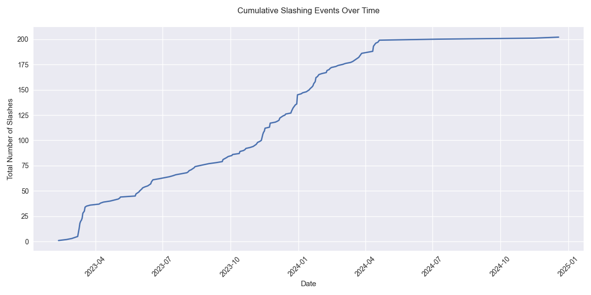
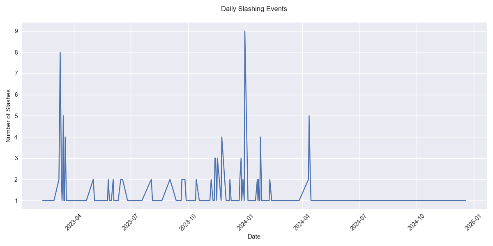

# Polkadot Slashing Analysis

This project analyzes slashing events on the Polkadot network to assess validator performance and risk metrics. Data is sourced from [Polkadot Subscan](https://polkadot.subscan.io/event?page=1&time_dimension=date&event_id=slashreported).

## Overview

Tanssi, built on Substrate framework (stable2407 as of Jul-29-2024), uses default Substrate slashing mechanisms without custom modifications. Analysis shows significant improvement in validator stability since the stable release.

Key findings from 2024:
- Number of Slashes: 57
- Total Stake Slashed: -0.0174%
- Average Slash Size: 0.0003%
- Effective Negative APY: -0.0174% (1.74% of delegated capital)

## Visualizations

### Cumulative Slashing Events


### Daily Slashing Events


The graphs demonstrate reduced slashing events after the stable release, averaging one slash per month.

## Project Structure
```
├── data/            # Raw data files (*.txt)
├── src/            
│   ├── process_slashing.py    # Initial data processing
│   ├── filter_slashing.py     # Remove duplicate era slashes
│   ├── visualize_slashing.py  # Daily slashing visualization
│   ├── visualize_cumulative.py # Cumulative trends
│   └── calculate_apy.py      # APY impact analysis
├── output/          # Generated visualizations and filtered data
└── README.md
```

## Setup and Execution

1. Install [Poetry](https://python-poetry.org/)

2. Install dependencies:
```bash
poetry install
```

3. Run scripts in sequence:
```bash
python src/process_slashing.py
python src/filter_slashing.py
python src/visualize_slashing.py
python src/visualize_cumulative.py
python src/calculate_apy.py
```

Scripts will process raw data from `data/` directory and generate:
- Filtered slashing data (CSV)
- Visualization graphs (PNG)
- Console output with APY impact analysis

## Data Processing
- Converts timestamp format to UTC
- Removes duplicate slashes from same era/validator
- Calculates perbill fractions for accurate APY impact
- Generates time-series visualizations